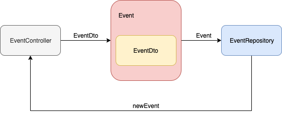

# 입력값 제한하기

> 이전 강의에서는 Test코드에서 Event객체를 만들어서 Post요청의 body에 넣어주었다. 그리고, body에 넣어준 Event가 결과로 잘 나오는지 확인했다.

Event객체의 ID, free 여부는 기본적으로 Server내부에서 생성해준다. 

:pushpin: 그래서, EventDto객체를 만들어 입력을 받고, Server에서 ID, free여부를 입력해주고, Event객체로 반환한다.


1. EventDto객체를 만든다. (id, free 필드가 없다.)

2. Test Code에서 @SpringBootTest로 모든 Bean을 mocking해주고, 기존 Mockito로 mocking한 부분을 뺀다.

   - **ModelMapper**를 사용하여 EventDto를 Event객체로 바꿔준다.

3. Controller에서 EventDto를 입력받고, eventRepository에 저장해준다.

   ```
   Event객체는 @Entity,@Id, @GeneratedValue annotation을 가지고 있는데, 이들이 JpaRespository.save의 메시지의 인자로 들어가면서, 각 기능을 수행한다.
   ```





# 입력값 이외에 에러 발생

> 입력값에 이상한 값이 들어올 경우 처리하는 법

입력값에 지정되지 않는값을 넣어줄때, 무시 vs Bad_request를 반환 에 대한 선택은 개인에게 맡긴다.


1. Bad_Request를 Expect하는 Test코드를 작성한다.
2. application.properties를 수정한다.


# Bad Request 처리

> 입력값에 있어야할 값들이 없는 경우 처리하는 법, 잘못들어온 경우 처리하는 법, Test description 작성 법

1. 입력값이 없는 경우를 Test코드로 작성한다.
   - Controller에서 @Valid를 붙인다.
   - EventDto객체에 알맞은 annotation을 붙인다.
2. 입력값이 잘못된 경우를 Test코드로 작성한다.
   - 값 검증에 로직이 필요한 경우 EventValidator를 만들어서 검증한다.
3. CustomAnnotation을 만들어서 Test Description을 작성한다.


## Bad Request 응답

> 잘못된 입력값에 대해 응답하는 법

1. 원하는 응답을 검사하는 Test를 작성한다.
2. Errors를 바로 반환할 수 없는데 이는 errors객체가 java bean을 만족하지 않기 때문이다.
3. ErrorsSerializer를 만든다.
   - errors는 field error와 globalerror로 나뉘어져 있다.


## 비즈니스 로직 적용

> basePrice, maxPrice에 따라 free여부가 달라지고, location값의 존재여부에 따라 offline인지 online인지 결정되는 비즈니스 로직을 구현한다.

1. 통합 Test에서 free, location 여부에 대한 코드를 작성한다.
2. Domain에 위에서 말한 내용의 Test코드를 작성한다.
3. Domain에서 비즈니스로직을 적용시킬 메소드를 생성하고, Controller에서 객체 생성후 메소드를 호출


## 매개변수를 이용한 테스트

> Test method에는 매개변수를 넣을 수 없어 기존에 중복되는 코드가 많았는데, JunitParams library를 이용하여 코드를 개선한다.

1. pom.xml에 JunitParams를 추가해준다.
2. Test코드를 수정 해준다.