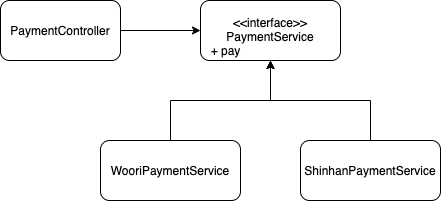

# 유연한 설계


## 01 개방-폐쇄 원칙

기존 코드를 수정하지 않고, application의 동작을 확장 할 수 있는 설계


### 컴파일타임 의존성을 고정시키고 런타임 의존성을 변경하라

8장에서 마지막에 한것처럼 DicountPolicy를 interface로 빼변 OCP원칙을 지킬 수 있다.


### 추상화가 핵심이다.

추상화, 변경 될만한 것을 추상화한다. 어떻게 할것인가??

- 공통적인 부분을 묶어서 하나로 만든다.


## 02 생성 사용 분리

생성과 사용은 분리해야 한다.

- 이 이유는 사용하는 곳에서 생성을 한다는 것은 의존성이 존재한다는 것이기 때문이다. 어떤 것을 사용할지 몰라야 하는데 생성과 사용을 한 클래스에서 하면 사용과 생성이 의존성을 갖는다.


### FACTORY 추가하기

Movie에서 생성과 사용을 함께 하는 것처럼 Client에서도 같은 현상이 일어나는데 이를 방지하기 위해 Factory를 만든다.


### 순수한 가공물에게 책임 할당하기

도메인 객체에서만 책임을 할당하면, 응집도 결합도에 대한 문제점을 해결할 수 없는데 이때, Factory와 같은 순수한 가공물을 만든다. 이는 실세계에 없다. 그래서 객체지향은 실세계의 모방이 아니다.

```
모든 책임을 도메인에게 할당하면, 낮은 응집도, 높은 결합도, 재사용성 저하와 같은 심각한 문제를 야기시킨다. 
그래서 설계자가 편의를 위해 임의로 만들어낸 가공의 객체에게 책임을 할당시켜 문제를 해결한다. 
이와 같이 도메인과 무관한 인공적인 객체를 PURE FABRICATION(순수한 가공물)이라고 부른다.
```


표현적 분해, 행위적 분해

: 도메인에 존재하는 사물 혹은 개념을 표현하는 객체들을 이용해 시스템을 분해하는 것을 표현적 분해라고 하는데, 이렇게 모든 책임을 도메인 객체에게 할당하면, 낮은 응집도, 높은 결합도를 야기 시킨다. 그래서 Factory와 같은 행위적 분해를 이용하여 행위적 분해가 필요하다.


## 03 의존성 주입

사용과 생성을 분리하기 위해 외부에서 인스턴스를 주입해 주는 것을 의존성 주입이라고 한다. 그 방법에는 생성자, setter, 메소드 호출 주입이 있다.


### 숨겨진 의존성은 나쁘다

의존성을 해결할 수 있는 방법 중 SERVICE LOCATOR 패턴이 있다. 이는 제3자(SERVICE LOCATOR)객체를 통해 의존성을 해결하는 것이다.

```java
ServiceLocator.provide(new AmountDiscountPolicy(...));
Movie avatar = new Movie("아바타", Duration.ofMinutes(120), Money.wons(10000));
```

하지만, 이는 의존성을 감추는 것이다. Movie와 AmountDiscountPolicy가 의존관계를 갖고 있다는 사실이 숨겨진다. 그래서 한 개발자가 위의 ```ServiceLocator.provide(new AmountDiscountPolicy(...));```를 호출하지 않고, ```Movie``` 를 생성한다면 ```NullpolintException``` 가 나올 것이다.

이는 테스트하기도 힘들다. ServiceLocator는 전역인데, 각 단위 테스트를 고립시키기가 어렵다.


## 04 의존성 역전 원칙

### 추상화와 의존성 역전

상위 수준 모듈은 하위 수준 모듈에 의존해서는 안된다.


### 의존성 역전 원칙(DIP)과 패키지

상위모듈과 하위 모듈은 추상화를 통해 서로 의존한다.

```
Movie와 추상 클래스인 DiscountPolicy를 하나의 패키지로 모아서 Movie를 특정한 컨텍스트로부터 완벽하게 독립시킨다.
Movie를 다른 컨텍스르에서 재사용하기 위해서는 Movie와 DiscountPolicy가 포함된 패키지만 재사용하면 된다.
```


#### 의존성 역전 원칙(DIP)

> 기존 전통적인 절차지향 프로그래밍에서는 상위 수준 모듈이 하위 모듈에 의존한다. 상위 모듈에서 하위 모듈의 함수를 호출하는 사례이다. 객체지향에서는 상위, 하위 모듈 모두 추상클래스에 의존한다. 방향이 바뀌었다. 그래서 '역전(Inversion)'을 사용하였다.

1. 상위 수준의 모듈은 하위 수준의 모듈에 의존해서는 안된다. 둘 모두 추상화에 의존해야 한다.
2. 추상화는 구체적인 사항에 의존해서는 안 된다. 구체적인 사항은 추상화에 의존해야 한다.


#### DIP를 준수하지 않은 코드


#### DIP 준수




https://cheese10yun.github.io/spring-solid-dip/


## 05 유연성에 대한 조언

### 유연한 설계는 유연성이 필요할 때만 옳다.

유연한 설계는 복잡성을 수반하기 때문에 항상 옳은 것은 아니다.


### 협력과 책임이 중요하다.

역할, 협력, 책임을 확실히 생각하고 이번장에서 배운 의존성을 생각하자

