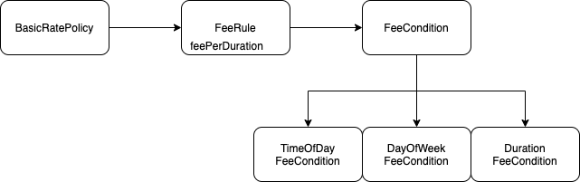

### 변경 캡슐화 하기

변하지 않는 부분 규칙을 FeeRule로 만들고, 변하는 부분을 FeeCondition 인터페이스로 만든 뒤 FeeRule클래스에 포함시켰다.

변하지 않는 규칙을 분리해서 추상화 한 후 변하는 적용조건(시간대별, 요일별, 구간별 방식)을 이 추상화의 서브타입으로 만든다.

### 협력 패턴 설계하기

BasicRatePolicy 통화목록의 call별로 FeeRule의 CalculateFee 메서드를 실행한다. FeeRule은 FeeConditions의 인스턴스에게 findTimeIntervals 메시지를 전송하고 이 메시지는 통화기간 중  '적용조건'(시간대별, 요일별, 구간별 방식)을 만족하는 구간을 갖는 DateTimeInterval의 List를 반환한다.

FeeConditions는 적용조건을 추상화한 슈퍼타입이다.

### 추상화 수준에서 협력 패턴 구현하기

위의 내용을 코드로 구현

### 구체적인 협력 구현하기

현재의 요금제가 시간대, 요일별, 구간별 정책인지 결정하는 기준은 FeeCondition을 대체하는 객체타입이 무엇인가에 달라진다.

#### 시간대별 정책

TimeOfDayCondition은 FeeRule에서 받은 findTimeInternals 메서드의 인자로 전달된 call로 부터 from, to를 받는다.

#### 요일별 정책

평일이나 주말을 따로 List에 묶어서 보관하는데, findTimeIntervals 메시지로 받은 call이 어떤 요일에 해당하는지 구분한다.

#### 구간별 정책

변하는 부분과 변하지 않는 부분을 나누었고, 유사한 협력 유지를 통해 개념적 무결성을 유지한다.

### 협력 패턴에 맞추기

고정요금제와 같은 경우 날짜를 나눌 필요가 없기 때문에 단위시간만 넘기면 된다. 이러면 기존 협력의 방식과 어울리지 않지만 일관성을 유지하는 설계가 더 현명하다.

### 패턴을 찾아라

협력을 일관성 있게 만든다는 것은 유사한 변경을 수용할 수 있는 패턴을 발견하는 것과 동일하다.

