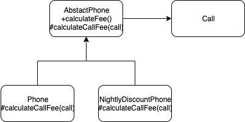

# 10 상속과 코드 재사용

> 상속과 합성을 통해 코드 재사용에 대해 살펴본다. 그전에 중복코드가 야기 시키는 문제점을 본다.

## 01 상속과 중복코드

중복코드는 불안하다.

### DRY 원칙

중복여부를 판단하는 기준은 변경이 일어났을때, 두 코드를 함께 수정해야 되는 경우다. DRY(Don't Repeat Yourself)원칙을 따라야 한다.

### 중복과 변경

#### 중복코드 살펴보기

일반요금을 계산하는 시스템에서 심야 요금제가 추가된 경우 일반요금을 계산하는 Class를 복붙해서 사용할 수 있다.(이는 중복코드 야기)

#### 중복코드 수정하기

#### 타입 코드 사용하기

복붙이 아닌 하나의 클래스로 만들고, 일반요금제 심야요금제를 구분하는 타입코드를 만든다. 하지만 이는 낮은 응집도 높은 결합도를 야기시킨다.(이게 왜???)

### 상속을 이용해서 중복코드 제거하기

상속을 통한 코드 재사용은 부모 클래스를 개발한 개발자가 세웠던 가정이나, 추론을 모두 이해해야 한다.

### 강하게 결합된 Phone과 NightlyDiscountPhone

상속을 사용할때 super를 통해 부모의 메서드를 호출할 경우 두 클래스는 강하게 결합된다. 부모클래스에서 세금부과(taxRate) 기능이 추가될 경우 자식 클래스에도 그에 대한 변경을 해야한다.

## 02 취약한 기반 클래스 문제

상속을 사용할 경우 기반클래스 변경시 파생 클래스의 잘못된 동작을 초래할 수 있다. 상속은 기반클래스(부모클래스)의 점진적 발전을 어렵게 만든다.

이와같이 부모 클래스의 변경에 의해 자식 클래스가 영향을 받는 현상을 **취약한 기반 클래스 문제**라고 한다.

### 불빌요한 인터페이스 상속 문제

Java초기 stack, properties에서 상속을 통한 파생클래스의 기반클래스 인터페이스 사용으로 인한 문제가 발생했다.

### 메서드 오버라이딩의 오작용 문제

??이게 뭔소리?

### 부모 클래스와 자식 클래스의 동시 수정 문제

부모클래스의 변경시 자식 클래스의 코드도 수정해야 하는 문제가 있다.

## 03 Phone 다시 살펴보기

Phone과 NightlyDiscountPolicy문제를 최소화 시켜보자

### 추상화에 의존하자

Phone과 NightlyDiscountPolicy를 추상화에 의존 하도록 하자

### 차이를 메서드로 추출하라

부모와 자식클래스의 차이점을 메소드로 추출한다.(같은 메서드 명)

### 중복 코드를 부모 클래스로 올려라

자식 클래스들의 공통점을 부모 클래스(추상 클래스)로 올린다.

### 추상화가 핵심이다.

코드의 재사용 그것은 복붙일 수 있고, 상속일 수 있다. 하지만 코드를 진화시키는데 걸림돌이 된다면 구조를 바꿔야 한다. 차이를 메소드로 만들고, 공통 부분은 부모 클래스로 이동하라.

> 이번 단원은 코드의 재사용을 위해 상속을 선택하였고, 상속중 추상 클래스를 이용한 상속에 대해 설명한다.

### 의도를 드러내는 이름 선택하기

각 역할에 맞는 이름이 중요하다.

### 세금 추가하기

공통 클래스에 추가하면 된다. 상속은 인스턴스 변수가 부모 클래스에 추가된다면 모든 자식클래스의 생성자에 부모클래스의 인스턴스 변수를 추가해야 한다.

## 04 차이에 의한 프로그래밍

차이에 의한 프로그래밍은 중복코드를 제거하고, 기존코드와 다름 부분만을 추가하여 Application의 기능을 확장하는 방법이자, 위의 가장 유명한 방법이 상속이다. 하지만 객체지향에 능숙한 개발자는 합성을 사용한다.

