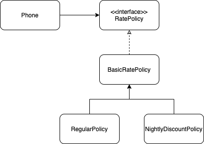
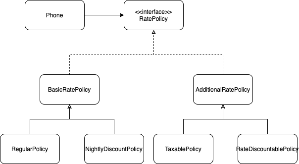
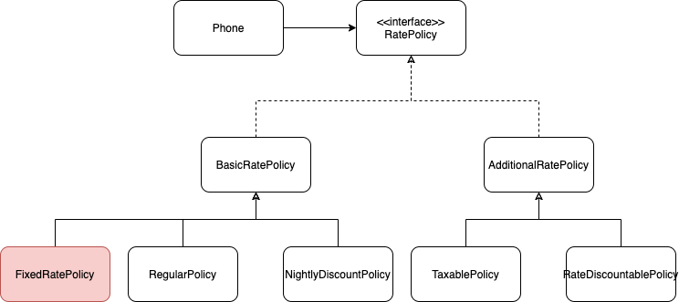

# 11장 합성과 유연한 설계


## 01 상속을 합성으로 변경하기

코드 재사용을 목적으로 상속을 사용 했을 때 문제점

1. 불필요한 인터페이스 상속 문제
2. 메서드 오버라이딩의 오작용 문제
3. 부모 클래스와 자식 클래스의 동시 수정 문제

부모 클래스의 인스턴스를 자식 클래스의 인스턴스 변수로 선언하면 된다. 그렇게 하여 상속의 3가지 문제점을 해결한다.


### 불필요한 인터페이스 상속 문제: java.util.Properties와 java.util.Stack

Public 인터페이스 만을 통해 협력하므로, 불필요한 인터페이스 상속을 막는다.

```
상속은 부모클래스의 대두분 오퍼레이션을 받는다. 이는 필요없는 것도 받는 것이다.
합성은 public으로 접근지정된 메소드만 받는다. is-a, has-a 관계라는게 is-a는 자식클래스가 부모클래스이다.
즉, 모든 메소드가 필요하다는 것을 의미한다.
```


### 메서드 오버라이딩의 오작용 문제: InstrumentedHasSet

HashSet의 상위 인터페이스는 implement해서 오버라이딩의 오작용을 막는다.

> 이 경우는  부모의 메서드도 똑같이 사용해야 하는 경우


### 부모 클래스와 자식 클래스의 동시 수정 문제: PersonalPlaylist

이는 해결되지 않지만, 부모 클래스 변경시 파급효과를 자식클래스에만 캡슐화 할 수 있다....???


## 02 상속으로 인한 조합의 폭발적인 증가

> 상속으로 인해 결합도가 높아지면 코드를 수정하는데 필요한 작업의 양이 과도하게 늘어나는 경향이 있다. 일반적인 상황은 작은 기능들을 조합해서, 더 큰 기능을 수행하는 객체를 만들어야 하는 경우다.


### 기본 정책과 부가 정책 조합하기

10장의 핸드폰 과금 시스템에 요구사항이 추가된 경우를 생각해본다. 기존에는 일반, 심야 요금제뿐이었지만, 두 요금제를 기본정책으로 하고, 추가적인 부과 요금제를 만들어 두 정책의 조합으로 요금을 계산한다. 이를 구현하는데, **<u>가장 큰 장벽은 기본 정책과 부가 정책의 조합 가능한 수가 너무 많다는 것이다.</u>**


### 상속을 이용해서 기본 정책 구현하기

부모클래스 Phone, 자식클래스 RegularPhone, NightlyDiscountPhone을 만든다.


### 기본 정책에 세금 정책 조합하기

일반 정책에 세금 정책을 조합해야 하는 경우, 상속을 사용한다면 RegularPhone클래스를 상속받은 TaxableRegularPhone클래스를 만들어 부모의 calaulateFee를 오버라이딩하여 구현 할 수 있다. 이렇게 하면, 부모와 자식간의 결합도가 높아지는데 이를 해결하기 추상메서드를 사용할 수 있다. 하지만, 이는 모든 자식클래스가 추상메서드를 구현해야하는 의무를 갖는다. 추상메소드가 많다면 이것도 쉬운일은 아니다. 또한 추상메서드를 오버라이드한 메소드간에 코드 중복이 생길 수 있다.

하나의 기능확장(세금 계산)을 위한 상속은 중복코드를 야기 시킨다.


### 기본 정책에 기본 요금 할인 정책 조합하기

일반 요금제와 기본 요금 할인 정책을 조합하고 싶다면, RegularPhone을 상속받는 RateDiscounttableRegularPhone클래스를 생성할 수 있다. 역시 RateDiscounttableRegularPhone, RateDiscountableNightlyDiscountPhone간에 코드 중복이 발생한다.

자식 클래스간에 코드 중복을 야기한다.


### 중복 코드의 덫에 걸리다.

상속을 이용한 해결방법은 조합별로 새로운 자식클래스를 추가하는 것이다. 이는 기능이 추가될 때 마다 계속 중복을 야기시킨다.


## 03 합성 관계로 변경하기

대부분의 의존성 관리 기법은 상속이 아닌 합성을 기반으로 한다.

합성은 런타임에 관계가 정해지기 때문에, 상속처럼 경우의 수를 구현하기 위해 클래스를 생성하지 않아도 된다.


### 기본 정책 합성하기

BasicRatePolicy를 추상 클래스로 만들고, 그 위에 interface(RatePolicy)를 추가한다.




### 부가 정책 적용하기

이제 부가정책을 추가해야하는데, 부가정책은 기본 정책에 대한 계산이 끝난 후 적용된다. 그래서 다음과 같이 클래스를 연결해야 한다.


그래서 모든 요금 계산과 관련된 클래스들의 관계를 다이어그램으로 표현하면, 다음과 같다.



AdditionRatePolicy를 추상클래스로 만들고, 세금, 할인에 대한 요금계산의 역할을 하는 클래스들이 상속 받도록 한다.


### 기본 정책과 부가 정책 합성하기

일반 요금제에 세금 정책을 조합한 경우

```java
Phone phone = new Phone(new TaxablePolicy(0.05, new RegularPolicy(...)));
```


일반 요금제 + 기본 요금 할인정책 + 세금 정책

```java
Phone phone = new Phone(new TaxablePolicy(
  0.05, 
  new RateDiscountablePolicy(Moneyt.wons(1000), 
                             new RegularPolicy(...)));
```


기본요금 할인 정책 적용 후 세금 정책

```java
Phone phone = new Phone(new RateDiscountablePolicy(
Money.wons(1000), 
  new TaxablePolicy(0.05, new RegularPolicy(...)));
```


### 새로운 정책 추가하기

합성을 기반으로 한 설계에서는 이 분제를 간단하게 해결할 수있다. 고정요금제가 필요하다면 고정요금제를 구현한 클래스 하나만 추가한 후 원하는 방식으로 조합하면 된다.




### 객체 합성이 클래스 상속보다 더 좋은 방법이다.

상속이 구현을 재사용하는 데 비해 합성은 객체의 인터페이스를 재사용한다.


## 04 믹스인

객체 생성시 코드의 일부를 클래스에 섞어 넣어 재사용 한다.??


### 기본 정책 구현하기

BasicRatePolicy를 상속받는 RegularPolicy, NightlyDiscountPolicy를 구현한다.


### 트레이트로 부가 정책 구현하기

trait의 extends는 제약을 의미한다. 그래서 trait의 super.calculateFee의 실행 시점은 BasicRatePolicy를 상속받은 객체가 실행 될때이다.


### 부가 정책 트레이트 믹스인하기

선언시점에서 동적인 실행순서 조작이 가능하다.


### 쌓을 수 있는 변경

믹스인은 상속과 다르게 동적으로 super class를 바인딩 할 수 있다.


